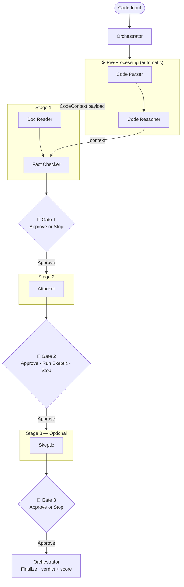

# RunChecks — DLW Hackathon Submission

**Track:** OpenAI
**Integration Pattern:** App Server (Responses API + Express backend)
**Category:** Developer Tools / AI-Augmented Code Review

---

## Problem Statement

Code review is the most important quality gate in software development — and the most consistently skipped under deadline pressure. When it does happen, reviewers must simultaneously check for correctness, security vulnerabilities, documentation accuracy, and behavioural regressions. No single human reviewer catches all of these reliably.

Existing AI tools generate suggestions in bulk with no prioritisation and no human control over what gets accepted. Developers end up overwhelmed or blindly clicking "accept all."

**RunChecks** solves this by structuring AI code review into staged, human-gated checkpoints. The AI does the deep analysis; the human makes every consequential decision.

---

## Multi-Agent System Architecture

> Drop the shared architecture diagram into this folder as `docs/architecture.png` to render it here.


Mermaid equivalent (renders on GitHub if the image is unavailable):



---

## What We Built

A VS Code extension backed by a stateful Express API that runs six AI agents across three gated review stages. Every stage requires explicit human approval before the next agent runs — nothing advances without a deliberate decision.

### How the agents connect

**Pre-processing — automatic on every review:**
- `Parser` splits raw source into logical segments (functions, classes, blocks) with language detection and line ranges
- `Reasoner` enriches segments with documentation context, producing a unified `CodeContext` payload consumed by all downstream agents

**Stage 1 — Fact Checker:**
- **Pass 1 (inline):** each parsed segment's comments are compared against its actual implementation via the LLM
- **Pass 2 (external docs):** `DocReader` extracts text from uploaded PDFs / DOCX / Markdown, then each doc section is compared against the code
- **Pass 3 (explicit rules):** any tagged rules (FR-xxx, AR-xxx, etc.) extracted from docs are verified against the code
- All three passes use `buildNumberedCode()` — a helper that preserves **absolute** line numbers even when code is truncated, ensuring the LLM always reports the correct file position
- `extractSnippet(code, line)` pulls ±3 lines around each reported line to populate the `codeSnippet` field shown in the UI
- Output: `findings[{ claim, reality, codeSnippet, severity, line, suggestion, docSource?, docSection?, docPage? }]`

**Stage 2 — Attacker:**
- OWASP Top-10 scan across the full `CodeContext`
- Injection, auth bypass, data exposure, broken access control checks
- PoC exploit generation with CWE tagging and an `exploitProof.confirmed` boolean
- Output: `findings[{ cwe, severity, attackVector, impact, exploitProof }]`

**Stage 3 — Skeptic (optional, user-initiated):**
- Shadow test execution: runs test suite or code snippet in isolated child process
- Builds chart-ready evidence: failure timeline, endpoint heatmap, latency distribution (first-half vs second-half proxy baseline), user journey failures
- `buildRecommendation()` synthesises findings + p99 latency data into a single actionable signal:
  - `hold` — any high/critical finding (blocks deployment, reasons listed)
  - `review` — medium findings OR p99 latency regression > 50% vs baseline
  - `approve` — all clear, safe to proceed
- Each recommendation includes a `context` paragraph (what the result means) and a `nextSteps` list (what to do next), rendered as a rich card — not just a label
- For JS runtime failures, `interpretError()` calls the LLM to convert the raw stderr into a plain-English one-sentence explanation of the root cause and fix, replacing the generic "Fix runtime errors" fallback
- Frontend renders a **colour-coded recommendation banner** (green / orange / red) at the top of the Skeptic panel before test results
- Output: `{ tests, evidence: { failureTimeline, endpointHeatmap, latencyDistribution, userJourneyFailures }, flow, recommendation: { action, label, context, nextSteps, reasons } }`

---

## Key Design Decisions

### 1. Staged gates, not parallel execution

Early designs ran all agents simultaneously. We switched to a strictly sequential gated model because:
- Correctness errors should be fixed before running a security scan — no value in scanning broken logic
- Each stage's findings inform how the reviewer interprets the next stage
- The human stays in control of both the compute cost and the time investment

### 2. Pre-processing as one unified step

The original design had a `builder` agent — a thin wrapper over `parser` + `reasoner`. We collapsed these into a single `runPreprocessingPipeline()` inside the orchestrator, eliminating a redundant abstraction and making the data flow explicit:

```
parser.run(payload)     →  { parsed: Segment[] }
reasoner.run({ ...payload, parsed })  →  CodeContext
```

`CodeContext` (code intent, structure, risk flags, doc references) is the shared input for all three review stages.

### 3. Challenge loop on critical findings

For every critical finding from FactChecker or Attacker, the orchestrator runs a challenge loop: it asks the `Reasoner` to respond with code-level evidence. This produces `challengeResponses` included in the final summary — preventing false positives from inflating the verdict.

### 4. Static callback pattern for panel decisions

The VS Code extension uses a static `onDecision` callback on `FindingsPanel` and `SkepticPanel`, set once at activation:

```typescript
FindingsPanel.onDecision = _handleFindingsDecision;
SkepticPanel.onDecision  = _handleSkepticDecision;
```

When a user clicks **Approve**, the webview posts a message → `_handleMessage` fires the callback → `extension.ts` calls `runNextAgent()`. No event bus, no polling, no state synchronisation overhead.

### 5. Boundary adapter keeps types decoupled

Backend agents return `{ agent, status, findings, summary }`. VS Code panels expect `{ agentName, stage, passed, findings: [{ type, severity, file, line, description, suggestion }] }`. A single `_adaptAgentResult()` function in `extension.ts` translates between these shapes at the API boundary — backend and frontend types stay fully independent.

### 6. Local doc storage avoids a separate upload API

The Setup panel stores uploaded docs in an in-memory array (`uploadedDocs`) within the extension. Docs are passed in the `/review/start` body, giving the Fact Checker's external pass access to reference material without a dedicated document management API.

### 7. Absolute line numbers survive code truncation (`buildNumberedCode`)

When code exceeds the LLM context budget, naively slicing and re-labelling lines (`1, 2, 3...`) causes the tail of the file to have wrong line numbers. `buildNumberedCode(code, maxChars)` splits the budget evenly between a **head** (from line 1) and a **tail** (from the end), labelling every line with its real file position and inserting an omission marker in between. The LLM always sees correct line numbers, so `extractSnippet` always retrieves the right code.

### 8. Unified buffer detection in DocReader (`toBuffer`)

VS Code's file-picker API, `FileReader`, JSON serialisation, and direct Buffer objects all produce different representations of the same binary content. A single `toBuffer(content)` function handles all four formats — native `Buffer`, JSON-serialised `{type:'Buffer',data:[...]}`, data URLs (`data:<mime>;base64,...`), and bare base64 strings — before passing content to `pdf-parse` or `mammoth`. This eliminated the "document failed to process" errors seen when uploading PDFs via the VS Code extension.

### 9. Skeptic as a decision engine, not just a reporter

The initial Skeptic design simply reported pass/fail counts and latency numbers. We added `buildRecommendation()` so the agent synthesises everything into one of three explicit actions. Each recommendation now ships with three layers:

- **`label`** — a one-line verdict (e.g. "Hold — Fix failures before deploying")
- **`context`** — a prose sentence explaining what the execution result actually means (e.g. "Shadow execution found 2 blocking failures — the tests are actively failing right now")
- **`nextSteps`** — a numbered list of concrete actions the developer should take next
- **`reasons`** — the raw evidence bullets (failing test names, latency deltas) dimmed below the action card

The frontend renders these as a structured card — not just a coloured badge — so developers immediately understand both what happened and what to do about it.

### 10. LLM error interpretation for runtime failures

Shadow execution captures raw stderr from the child process. Stack traces like `TypeError: Cannot read properties of undefined (reading 'map') at Object.<anonymous> (/tmp/snippet.js:12:9)` are accurate but require reading the code to understand. We added `interpretError()` — a narrow LLM call (≤120 tokens) that receives the code and the raw error and returns a single plain-English sentence: what failed and exactly what to change. This call is skipped entirely for timeouts (the cause is always a loop/blocking call, no LLM needed) and for non-JS languages (shadow runner doesn't execute them). Rule-based logic handles all other recommendation logic; the LLM is used only where raw output is genuinely opaque to the developer.

---

## Backend API — Session Lifecycle

Each stepped review opens a session (keyed by `sessionId`) stored in a `REVIEW_SESSIONS` map. Sessions auto-expire after 1 hour.

```
POST /review/start
  body:    { code, filePath, lineStart?, lineEnd?, docs? }
  runs:    Parser → Reasoner
  stores:  session with enrichedPayload + agentResults = { reasoner }
  returns: { sessionId, reasonerResult, partialReview, checkpoint }

POST /review/next
  body:    { sessionId, agent }    agent ∈ { factchecker, attacker, skeptic }
  guards:  factchecker before attacker · attacker before skeptic · no re-runs
  runs:    requested agent against session.enrichedPayload
  returns: { ranAgent, agentResult, agentSummary, partialReview, checkpoint }

POST /review/finalize
  body:    { sessionId }
  runs:    challenge loop on criticals → deduplicate → sort → score → verdict
  logs:    audit_log row
  deletes: session
  returns: { verdict, score, prioritizedFindings, agentResults, summary }
```

Ordering is enforced server-side with HTTP 409:

```javascript
if (agent === 'attacker' && !session.agentResults.factchecker)  → 409
if (agent === 'skeptic'  && !session.agentResults.attacker)     → 409
if (session.agentResults[agent])                                → 409  // already ran
```

---

## Frontend — Extension Flow

```
activate()
  ├── register AgentStatusPanel  (sidebar WebviewView — pipeline strip)
  ├── FindingsPanel.onDecision = _handleFindingsDecision
  ├── SkepticPanel.onDecision  = _handleSkepticDecision
  └── register commands: startReview · openSetup · showStatus

runchecks.startReview
  → client.startReview(code, filePath, lineStart, lineEnd)
  → notification: "Pre-processing complete — Run Fact Checker?"
  → _runAgent('factchecker')
      → client.runNextAgent(sessionId, 'factchecker')
      → _adaptAgentResult()   ← maps { agent, status, findings } → AgentResult
      → FindingsPanel.show()

FindingsPanel: Approve (stage = factchecker)
  → _runAgent('attacker') → FindingsPanel.show() with attacker findings

FindingsPanel: Approve (stage = attacker)
  → modal: "Run Skeptic?" / "Finalize Now"

SkepticPanel: Approve  OR  FindingsPanel: Finalize Now
  → client.finalizeReview(sessionId)
  → notification: "✅ APPROVE — Score: 92/100"
```

### Panels

| Panel | VS Code type | Role |
|---|---|---|
| `AgentStatusPanel` | `WebviewViewProvider` (sidebar) | Live pipeline strip with stage labels and agent state badges |
| `SetupPanel` | `WebviewPanel` (tab) | Doc upload (PDF / DOCX / Markdown) to in-memory store + guidance to start review |
| `FindingsPanel` | `WebviewPanel` (tab) | Per-agent findings — CLAIM / REALITY / CODE snippet cards with clickable `file:line` links and severity badges; Approve / Make Changes footer |
| `SkepticPanel` → `FindingsPanel` | `WebviewPanel` (tab) | Colour-coded recommendation banner (approve / review / hold), test result counters, Chart.js bar charts, latency table, user journey list, SVG flow diagram |
| Verdict page (inside `FindingsPanel`) | Inline HTML section | Final APPROVE / REQUEST CHANGES / BLOCK verdict with score, prioritised findings in CLAIM/REALITY/CODE format, and clickable file links |

All webviews use CSP-safe nonce injection. Chart.js CDN is scoped only to the Skeptic view's `Content-Security-Policy` header. Colors in Chart.js are resolved via `getComputedStyle` rather than CSS variable strings, ensuring correct rendering in all VS Code themes.

---

## Scoring & Verdict

Score starts at **100** and deducts per finding:

| Severity | Deduction |
|---|---|
| Critical | −25 |
| High | −15 |
| Medium | −5 |
| Low | −2 |
| PoC-confirmed exploit | −10 per confirmed exploit (additional) |

Verdict is determined from **what was found** — not from the score:

```javascript
hasCritical || confirmedExploit          →  BLOCK
hasHigh || attackerFailed || factFailed  →  REQUEST CHANGES
otherwise                                →  APPROVE
```

The score is an informational metric shown in the verdict notification and summary. The verdict is always driven by actual finding severity.

---

## Data Persistence

Two SQLite tables in `backend/data/audit.db` (auto-created on first run):

**`audit_log`** — one row per finalized review:
```
timestamp | agent_name | findings (JSON) | human_decision | session_id | file_path
```

**`document_chunks`** — one row per embedded chunk (RAG context for Fact Checker):
```
session_id | file_path | chunk_index | content | embedding (JSON float[])
```

Retrieval: cosine similarity between the query embedding (first 500 chars of code) and stored chunks; top-5 results injected into the review payload as `payload.context`.

---

## Tech Stack

| Layer | Technology | Why |
|---|---|---|
| Backend | Node.js + Express (CommonJS) | Fast to scaffold, native OpenAI SDK support |
| LLM | OpenAI Responses API (`gpt-4o`) | Structured output, tool use, long context window |
| Embeddings | `text-embedding-3-small` | Low cost, strong retrieval quality |
| Vector store | SQLite + cosine similarity | Zero infra, works fully offline |
| Audit log | SQLite (`audit_log`) | Lightweight, inspectable, no extra services |
| Frontend | VS Code Extension API + TypeScript | Native IDE integration, no browser required |
| Bundler | webpack 5 (`target: node`) | Required for VS Code extension packaging |
| Charts | Chart.js 4 (CDN) | Rich bar charts in Skeptic webview; CSP-scoped to that panel only |
